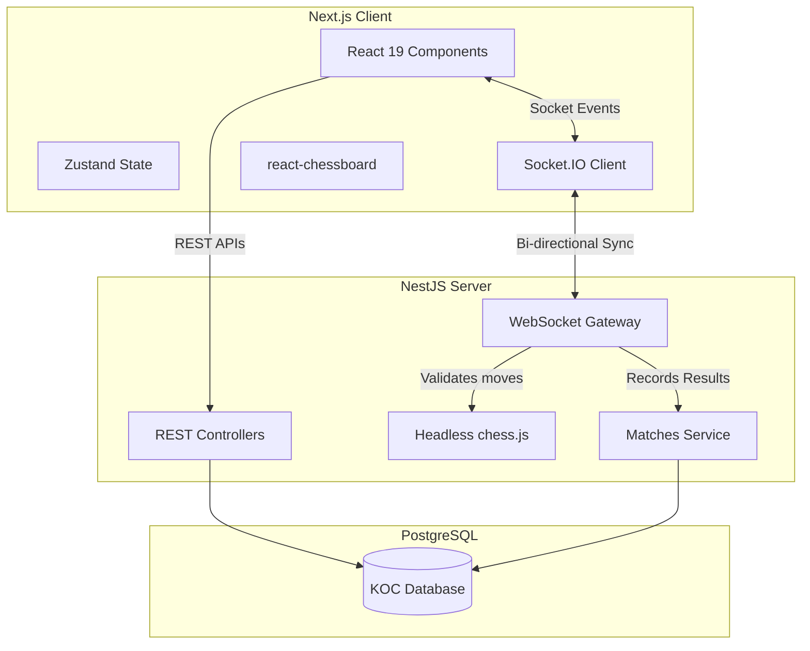
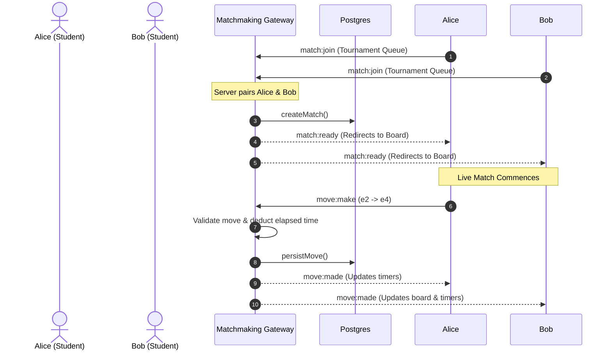
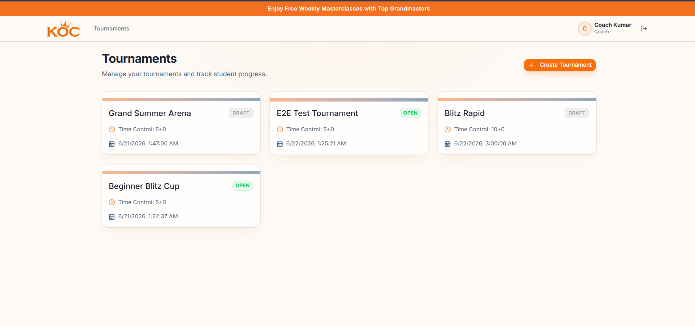
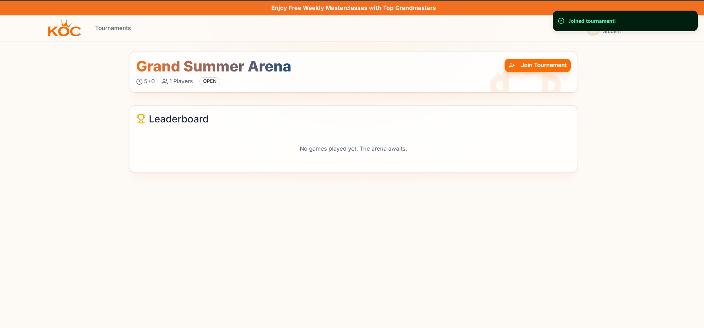
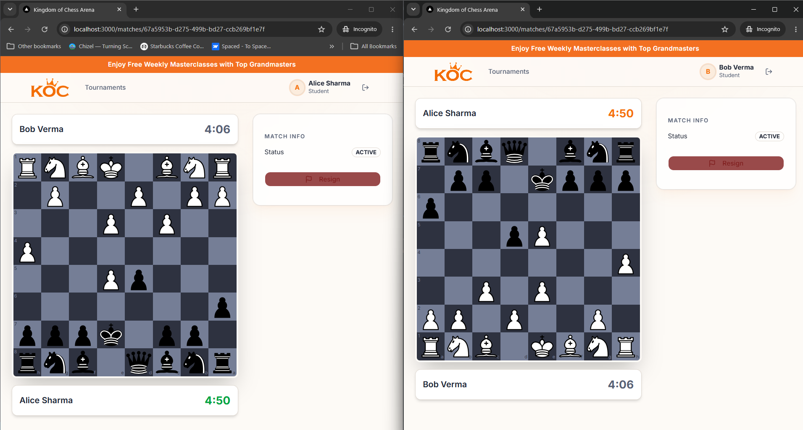
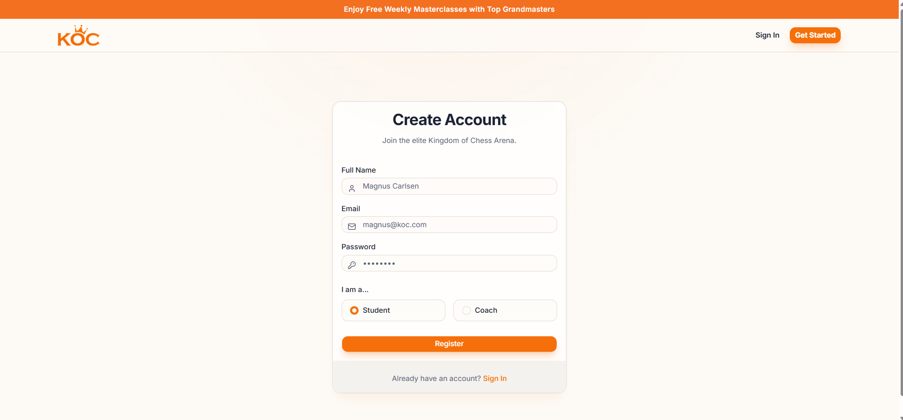
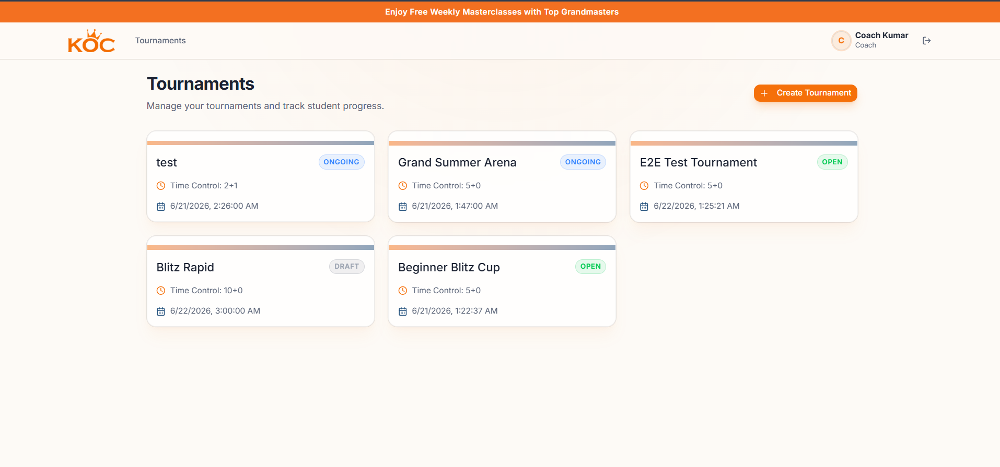
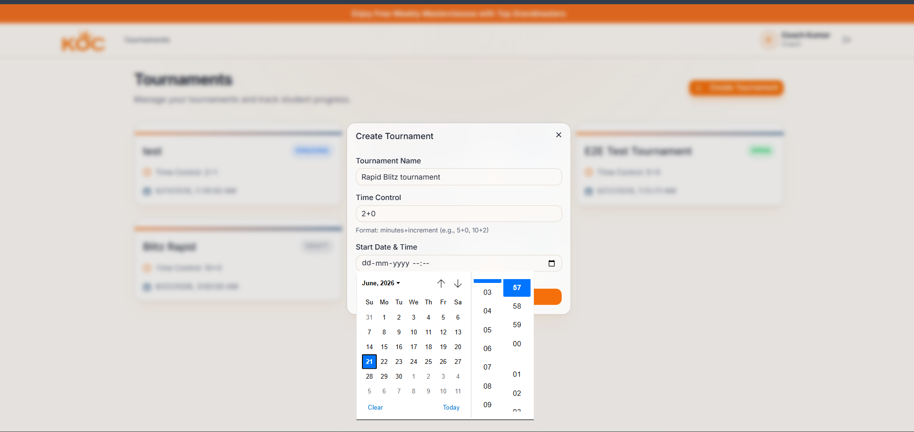
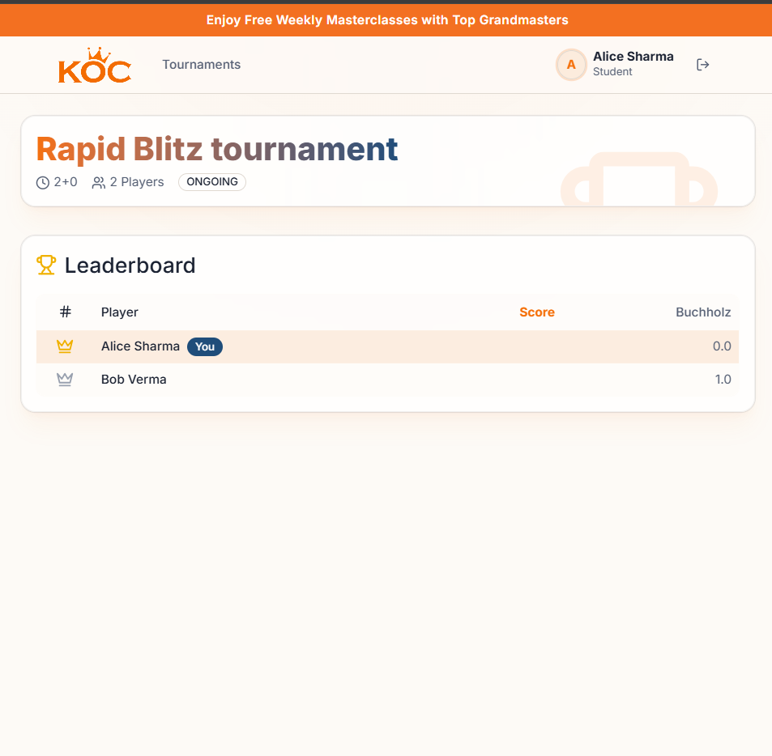

<div align="center">
  
  <h1>♚ Kingdom of Chess (KOC) Arena ♚</h1>
  <p><strong>A Full-Stack, Real-Time, Server-Authoritative Multiplayer Chess Platform</strong></p>

  [](https://nextjs.org/)
  [](https://nestjs.com/)
  [](https://socket.io/)
  [](https://postgresql.org/)
  [](https://tailwindcss.com/)
</div>

---

## 📖 Table of Contents
1. [🌟 Core Features](#-core-features)
2. [🛠️ Tech Stack](#️-tech-stack)
3. [🏗️ System Architecture](#️-system-architecture)
4. [📂 Codebase Structure](#-codebase-structure)
5. [🚀 Quickstart: From Clone to Play](#-quickstart-from-clone-to-play)
6. [📸 Demo Screenshots](#-demo-screenshots)
7. [📡 WebSockets Dictionary](#-websockets-dictionary)
8. [⚖️ Engineering Decisions & Trade-offs](#️-engineering-decisions--trade-offs)

---

## 🌟 Core Features
- **Server-Authoritative Game Engine**: A headless `chess.js` instance runs on the backend validating every move. A tampered client cannot spoof an illegal move or cheat the clock.
- **Real-Time Synchronization**: WebSockets provide instantaneous, two-way move syncing between paired opponents.
- **Automated Matchmaking**: Students join a FIFO queue and are instantly paired and seamlessly redirected to a live board.
- **Robust Reconnections**: Accidentally close the tab? No problem. The server remembers exactly whose turn it is, the board FEN, and exactly how many milliseconds are left on the clock.
- **Automated Leaderboards**: Points are dynamically awarded upon match completion (1 for a win, 0.5 for a draw), calculating tournament rankings on the fly.
- **Role-Based Access Control**: Strict JWT protections segregate Coach (Admin) and Student (Player) actions.

---

## 🛠️ Tech Stack
- **Backend:** NestJS 11 (Strict Mode), TypeScript, Socket.IO, Drizzle ORM, PostgreSQL, class-validator.
- **Frontend:** Next.js 15 (App Router, Strict Mode), React 19, TailwindCSS v4, shadcn/ui, TanStack React Query, Socket.IO Client, `react-chessboard`.
- **Game Engine:** `chess.js` (used headless on the server for strict move validation and on the client for local rendering and PGN).

---

## 🏗️ System Architecture

The project maintains a strict separation of concerns. The Next.js frontend handles UI/UX and optimistic rendering, while the NestJS backend handles all state mutation, validation, and real-time broadcasting.

### Component Relationship


### Matchmaking & Core Loop Flow


---

## 📂 Codebase Structure

The repository is built as a highly scalable monorepo-style structure, housing both discrete services:

```text
KOC-task/
├── backend/                  # NestJS Application
│   ├── src/
│   │   ├── auth/             # JWT Authentication & Role Guards
│   │   ├── users/            # User Management & Seeders
│   │   ├── tournaments/      # Tournament CRUD operations
│   │   ├── matches/          # Database persistence for live matches
│   │   ├── matchmaking/      # THE CORE: Socket.IO Gateway & Live State
│   │   └── leaderboard/      # Ranking calculations
│   └── drizzle/              # DB Schema & Migrations
│
├── frontend/                 # Next.js Application
│   ├── src/
│   │   ├── app/              # App Router Pages (Login, Matches, etc)
│   │   ├── components/       # Reusable UI Components (shadcn)
│   │   ├── hooks/            # Custom Hooks (useSocket)
│   │   └── store/            # Zustand Stores (useMatchStore)
│   └── public/               # Static Assets
│
└── docker-compose.yml        # Orchestrates Postgres, Backend, and Frontend
```

---

## 🚀 Quickstart: From Clone to Play

We have containerized the entire stack for an absolutely frictionless reviewing experience. No need to install Postgres locally or juggle node versions!

### Step 1: Clone the Repository
```bash
git clone <your-repository-url>
cd KOC-task
```

### Step 2: Ensure Docker is Running
Make sure you have **Docker Desktop** installed and running on your machine.

### Step 3: Spin Up the Stack
Run the following command from the root of the project. It will automatically build the Next.js frontend, the NestJS backend, and provision a fresh PostgreSQL database.
```bash
docker compose up --build -d
```
*Note: The `docker-compose.yml` is pre-configured to utilize the `.env.example` files automatically, so you don't even need to configure environment variables to get started! Database migrations and seeding also happen automatically on boot.*

### Step 4: Verify the Services
The application is now live!
- **Frontend UI:** [http://localhost:3000](http://localhost:3000)
- **Backend API:** [http://localhost:3001](http://localhost:3001)

### Step 5: Test the Application (The Live Match)
The database has already been seeded with dummy accounts. Here is exactly how to test the real-time matchmaking and gameplay:

**1. Create & Start a Tournament (As a Coach)**
1. Open a browser tab to `http://localhost:3000`.
2. Log in using the Coach credentials:
   - **Email:** `coach@koc.com`
   - **Password:** `Coach@123`
3. Click **Create Tournament**, give it a name, and hit Save.
4. On the tournament's details page, click the **Start Tournament** button. The status will change from `DRAFT` to `OPEN`.

**2. Join the Matchmaking Queue (As Students)**
1. Open a brand new **Incognito/Private** window.
2. Log in as Student 1:
   - **Email:** `alice@koc.com`
   - **Password:** `Student@123`
3. Navigate to the tournament you just created, hit **Join**, and then click **Find Match**. Alice is now waiting in the queue.
4. Open a *second*, completely separate **Incognito/Private** window.
5. Log in as Student 2:
   - **Email:** `bob@koc.com`
   - **Password:** `Student@123`
6. Navigate to the same tournament, hit **Join**, and click **Find Match**.

**3. Play the Game!**
1. The server will instantly detect two eligible players, pair them, generate a game, and seamlessly route both browsers to the live 3D chessboard.
2. The user assigned **White** goes first. Drag and drop a piece!
3. Watch the clocks automatically sync and count down in real time, and watch the move instantly replicate onto the opponent's screen via WebSockets.
4. Test out the **Resign** button to immediately end the match and declare a winner!

---

## 📸 Demo Screenshots
<div align="center">
  
  <br/><br/>
  
  <br/><br/>
  
  <br/><br/>
  
  <br/><br/>
  
  <br/><br/>
  
  <br/><br/>
  
</div>

---

### Seeded Credentials Cheat Sheet
If you want to test further, the following accounts exist in the database:
| Role | Name | Email | Password |
|:---:|:---|:---|:---|
| 👑 **Coach** | Admin Coach | `coach@koc.com` | `Coach@123` |
| ♟️ **Student** | Alice Sharma | `alice@koc.com` | `Student@123` |
| ♟️ **Student** | Bob Verma | `bob@koc.com` | `Student@123` |
| ♟️ **Student** | Charlie King | `charlie@koc.com` | `Student@123` |
| ♟️ **Student** | Diana Queen | `diana@koc.com` | `Student@123` |

---

## 📡 WebSockets Dictionary

The entire live-play feature operates on a single Socket.IO connection. Below is the documentation for all custom events emitted and received.

| Event Name | Direction | Payload Example | Purpose |
|---|---|---|---|
| `matchmaking:join` | **C → S** | `{ tournamentId: "uuid" }` | Pushes player into the FIFO waiting queue. |
| `match:ready` | **S → C** | `{ matchId: "uuid", color: "white" }` | Notifies paired clients to redirect to match room. |
| `match:join` | **C → S** | `{ matchId: "uuid" }` | Connects socket to the specific match room ID. |
| `match:state` | **S → C** | `{ fen: "rnb...", turn: "white", ... }` | Emits current server-authoritative board state. |
| `move:make` | **C → S** | `{ matchId: "uuid", from: "e2", to: "e4" }` | Attempts to make a move. Server validates. |
| `move:made` | **S → C** | `{ fen: "...", turn: "black" }` | Broadcasts validated move to both players. |
| `clock:tick` | **S → C** | `{ whiteTimeMs: 290000 }` | Fired dynamically to sync countdowns. |
| `game:resign` | **C → S** | `{ matchId: "uuid" }` | Player requests to forfeit. |
| `game:over` | **S → C** | `{ result: "white_wins" }` | Match has ended (mate, draw, resign, timeout). |

---

## ⚖️ Engineering Decisions & Trade-offs

### 1. Server-Authoritative Game Engine
Instead of merely relaying move strings between clients, the `MatchmakingGateway` initializes an in-memory `chess.js` instance for every single active match. 
- **Why:** Security and robustness. A tampered client cannot force an illegal move, bypass turn logic, or manipulate the FEN state to win. 
- **Trade-off:** In-memory maps (`this.liveMatches`) don't natively scale horizontally. If we deployed 5 backend nodes behind a load balancer, we would need to store serialized FEN strings in Redis alongside a Socket.IO Redis Adapter to route events properly.

### 2. Time Synchronization Strategy
Timers dynamically calculate elapsed time server-side (`Date.now() - state.lastMoveAt`) on every move, and broadcast static `clock:tick` updates to clients.
- **Why:** Centralized clocks mean players can't lose due to browser background throttling or JS UI lag.
- **Trade-off:** Emitting an event every 1000ms per match creates heavy server traffic. In an enterprise production app, we would emit time state only *when a move is made*, and let the client optimistically interpolate the ticking visual natively using `requestAnimationFrame`. 

### 3. Database ORM (Drizzle)
- **Why:** Drizzle generates highly optimized, lightweight SQL queries and integrates seamlessly with our monorepo TypeScript schemas without the extreme bloat of TypeORM.
- **Trade-off:** Defining the schema requires manual explicit mapping, meaning slightly slower initial scaffolding, but significantly better long-term maintainability.

### 4. Error Boundary Catching
Every Socket event on the backend is wrapped in strict `try/catch` blocks that emit generalized `exception` strings back to the user interface. This guarantees that if a database timeout or edge-case validation failure occurs mid-game, the WebSocket server doesn't crash—it gracefully rejects the input and notifies the player via a UI Toast.

---

<div align="center">
  <b>Designed & Developed by <a href="https://github.com/Rajvansh-1">Rajvansh-1</a></b>
</div>
