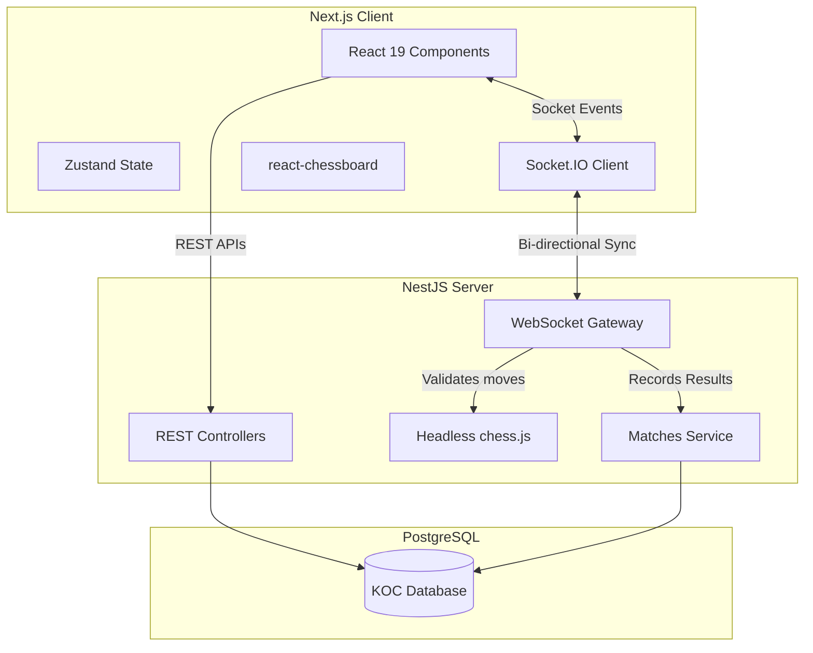
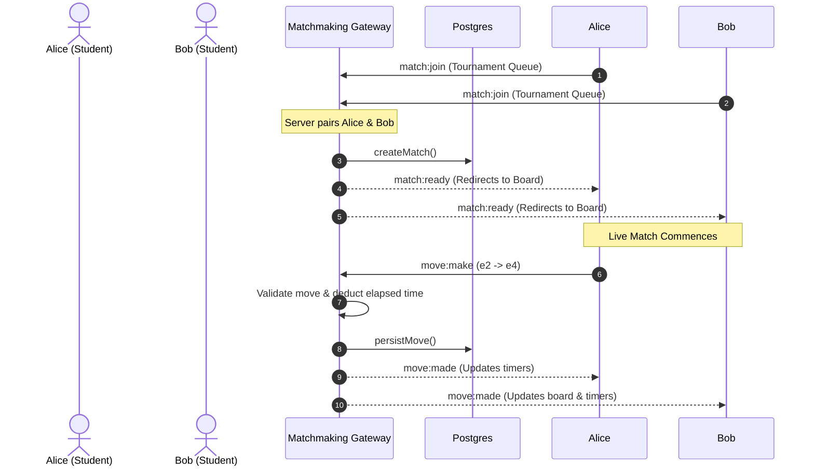

<div align="center">
  
  <h1>♚ Kingdom of Chess (KOC) Arena ♚</h1>
  <p><strong>A Full-Stack, Real-Time, Server-Authoritative Multiplayer Chess Platform</strong></p>

  [](https://nextjs.org/)
  [](https://nestjs.com/)
  [](https://socket.io/)
  [](https://postgresql.org/)
  [](https://tailwindcss.com/)
</div>

---

## 📖 Table of Contents
1. [🌟 Core Features](#-core-features)
2. [🏗️ System Architecture](#-system-architecture)
3. [📂 Codebase Structure](#-codebase-structure)
4. [🚀 Quickstart & Setup](#-quickstart--setup)
5. [🎮 How to Play Locally](#-how-to-play-locally)
6. [📡 WebSockets Dictionary](#-websockets-dictionary)
7. [⚖️ Engineering Decisions & Trade-offs](#-engineering-decisions--trade-offs)

---

## 🌟 Core Features
- **Server-Authoritative Game Engine**: A headless `chess.js` instance runs on the backend validating every move. A tampered client cannot spoof an illegal move or cheat the clock.
- **Real-Time Synchronization**: WebSockets provide instantaneous, two-way move syncing between paired opponents.
- **Automated Matchmaking**: Students join a FIFO queue and are instantly paired and seamlessly redirected to a live board.
- **Robust Reconnections**: Accidentally close the tab? No problem. The server remembers exactly whose turn it is, the board FEN, and exactly how many milliseconds are left on the clock.
- **Automated Leaderboards**: Points are dynamically awarded upon match completion (1 for a win, 0.5 for a draw), calculating tournament rankings on the fly.
- **Role-Based Access Control**: Strict JWT protections segregate Coach (Admin) and Student (Player) actions.

---

## 🏗️ System Architecture

The project maintains a strict separation of concerns. The Next.js frontend handles UI/UX and optimistic rendering, while the NestJS backend handles all state mutation, validation, and real-time broadcasting.

### Component Relationship


### Matchmaking & Core Loop Flow


---

## 📂 Codebase Structure

The repository is built as a highly scalable monorepo-style structure, housing both discrete services:

```text
KOC-task/
├── backend/                  # NestJS Application
│   ├── src/
│   │   ├── auth/             # JWT Authentication & Role Guards
│   │   ├── users/            # User Management & Seeders
│   │   ├── tournaments/      # Tournament CRUD operations
│   │   ├── matches/          # Database persistence for live matches
│   │   ├── matchmaking/      # THE CORE: Socket.IO Gateway & Live State
│   │   └── leaderboard/      # Ranking calculations
│   └── drizzle/              # DB Schema & Migrations
│
├── frontend/                 # Next.js Application
│   ├── src/
│   │   ├── app/              # App Router Pages (Login, Matches, etc)
│   │   ├── components/       # Reusable UI Components (shadcn)
│   │   ├── hooks/            # Custom Hooks (useSocket)
│   │   └── store/            # Zustand Stores (useMatchStore)
│   └── public/               # Static Assets
│
└── docker-compose.yml        # Orchestrates Postgres, Backend, and Frontend
```

---

## 🚀 Quickstart & Setup

### 1. Requirements
- **Docker Desktop** installed and running.
- **Node.js** (v20+) and **pnpm** (if developing outside of Docker).

### 2. Environment Variables
No manual configuration is required to test! The `docker-compose.yml` is hardcoded to mount the provided `.env.example` configurations. 
*Note: If running natively without Docker, copy the `.env.example` file to `.env` in the `backend/` directory and configure your local Postgres instance.*

### 3. Database Migrations & Seeding
The backend handles database schema pushing and seeding automatically. 
When the backend starts, it runs `npm run db:push` and `npm run db:seed`. This provisions the schema and populates the database with:
- **1 Coach**
- **4 Students**

#### Seed Credentials
| Role | Name | Email | Password |
|:---:|:---|:---|:---|
| 👑 **Coach** | Admin Coach | `coach@koc.com` | `Coach@123` |
| ♟️ **Student** | Alice Sharma | `alice@koc.com` | `Student@123` |
| ♟️ **Student** | Bob Verma | `bob@koc.com` | `Student@123` |
| ♟️ **Student** | Charlie King | `charlie@koc.com` | `Student@123` |
| ♟️ **Student** | Diana Queen | `diana@koc.com` | `Student@123` |

### 4. Starting the Application
Simply run the following command from the root of the project:
```bash
docker compose up --build -d
```
This will spin up:
- **PostgreSQL** on port `5432`
- **NestJS Backend** on `http://localhost:3001`
- **Next.js Frontend** on `http://localhost:3000`

---

## 🎮 How to Play Locally

To test the real-time sync, you need to simulate two separate players.

1. **Create the Tournament:** 
   - Open a browser window to `http://localhost:3000`. Log in as the **Coach** (`coach@koc.com`). 
   - Click *Create Tournament*, fill the details, and hit Save.
   - Click the **Start Tournament** button on its detail page. It is now open.
2. **Setup Player 1:** 
   - Open an **Incognito/Private** window. Log in as **Alice** (`alice@koc.com`).
   - Navigate to the Tournament and click **Join**, then click **Find Match**.
3. **Setup Player 2:** 
   - Open a **Second Incognito** window. Log in as **Bob** (`bob@koc.com`).
   - Navigate to the Tournament, hit Join, and click **Find Match**.
4. **The Match:** 
   - The server will detect both waiting players, pair them, generate the game, and seamlessly route both browsers to the 3D chessboard. Make your first move as White and watch the server sync it across to Black instantly!

---

## 📡 WebSockets Dictionary

The entire live-play feature operates on a single Socket.IO connection. Below is the documentation for all custom events emitted and received.

| Event Name | Direction | Payload Example | Purpose |
|---|---|---|---|
| `matchmaking:join` | **C → S** | `{ tournamentId: "uuid" }` | Pushes player into the FIFO waiting queue. |
| `match:ready` | **S → C** | `{ matchId: "uuid", color: "white" }` | Notifies paired clients to redirect to match room. |
| `match:join` | **C → S** | `{ matchId: "uuid" }` | Connects socket to the specific match room ID. |
| `match:state` | **S → C** | `{ fen: "rnb...", turn: "white", ... }` | Emits current server-authoritative board state. |
| `move:make` | **C → S** | `{ matchId: "uuid", from: "e2", to: "e4" }` | Attempts to make a move. Server validates. |
| `move:made` | **S → C** | `{ fen: "...", turn: "black" }` | Broadcasts validated move to both players. |
| `clock:tick` | **S → C** | `{ whiteTimeMs: 290000 }` | Fired dynamically to sync countdowns. |
| `game:resign` | **C → S** | `{ matchId: "uuid" }` | Player requests to forfeit. |
| `game:over` | **S → C** | `{ result: "white_wins" }` | Match has ended (mate, draw, resign, timeout). |

---

## ⚖️ Engineering Decisions & Trade-offs

### 1. Server-Authoritative Game Engine
Instead of merely relaying move strings between clients, the `MatchmakingGateway` initializes an in-memory `chess.js` instance for every single active match. 
- **Why:** Security and robustness. A tampered client cannot force an illegal move, bypass turn logic, or manipulate the FEN state to win. 
- **Trade-off:** In-memory maps (`this.liveMatches`) don't natively scale horizontally. If we deployed 5 backend nodes behind a load balancer, we would need to store serialized FEN strings in Redis alongside a Socket.IO Redis Adapter to route events properly.

### 2. Time Synchronization Strategy
Timers dynamically calculate elapsed time server-side (`Date.now() - state.lastMoveAt`) on every move, and broadcast static `clock:tick` updates to clients.
- **Why:** Centralized clocks mean players can't lose due to browser background throttling or JS UI lag.
- **Trade-off:** Emitting an event every 1000ms per match creates heavy server traffic. In an enterprise production app, we would emit time state only *when a move is made*, and let the client optimistically interpolate the ticking visual natively using `requestAnimationFrame`. 

### 3. Database ORM (Drizzle)
- **Why:** Drizzle generates highly optimized, lightweight SQL queries and integrates seamlessly with our monorepo TypeScript schemas without the extreme bloat of TypeORM.
- **Trade-off:** Defining the schema requires manual explicit mapping, meaning slightly slower initial scaffolding, but significantly better long-term maintainability.

### 4. Error Boundary Catching
Every Socket event on the backend is wrapped in strict `try/catch` blocks that emit generalized `exception` strings back to the user interface. This guarantees that if a database timeout or edge-case validation failure occurs mid-game, the WebSocket server doesn't crash—it gracefully rejects the input and notifies the player via a UI Toast.
